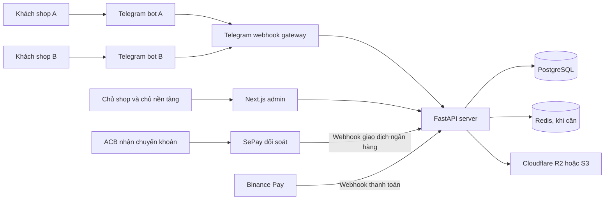

# Telegram Digital Shop

Telegram Digital Shop là nền tảng cho thuê bot bán file và tài khoản số qua Telegram. Mỗi khách thuê có bot, giao diện, sản phẩm, kho hàng, phương thức thanh toán và tập khách hàng riêng. Người mua có thể xem sản phẩm, tạo đơn, thanh toán và nhận hàng ngay trong cuộc trò chuyện với bot.

> Dự án đang ở giai đoạn khởi tạo. README này mô tả phạm vi và kiến trúc dự kiến trước khi bắt đầu viết code.

## Mục tiêu

- Xây dựng quy trình mua hàng đơn giản ngay trong Telegram.
- Tự động giao file hoặc tài khoản sau khi thanh toán được xác nhận.
- Có trang quản trị riêng, dễ sử dụng trên máy tính và điện thoại.
- Bảo vệ thông tin tài khoản số được lưu trong kho.
- Cho phép nhiều shop cùng sử dụng một hệ thống mà dữ liệu không lẫn nhau.
- Cho phép đổi bot và tài khoản nhận thanh toán trong Admin mà không sửa `.env` hoặc restart server.
- Giữ kiến trúc đủ gọn để phát triển nhanh nhưng vẫn có thể mở rộng về sau.

## Chức năng dự kiến

### Dành cho khách hàng

- Khởi động bot bằng lệnh `/start`.
- Mở lại menu chính bằng lệnh `/menu`.
- Xem danh mục và thông tin sản phẩm.
- Tìm kiếm, chọn sản phẩm và tạo đơn hàng.
- Nạp tiền vào ví hoặc thanh toán trực tiếp cho đơn hàng.
- Theo dõi trạng thái đơn hàng.
- Nhận file hoặc thông tin tài khoản sau khi thanh toán thành công.
- Xem lại lịch sử mua hàng.
- Gửi yêu cầu bảo hành cho sản phẩm đã mua.
- Liên hệ hỗ trợ khi giao hàng gặp lỗi.
- Chọn ngôn ngữ hiển thị.

### Dành cho quản trị viên

- Đăng nhập vào trang quản trị.
- Xem doanh thu, số đơn và tình trạng kho.
- Thêm, sửa, ẩn hoặc xóa sản phẩm.
- Upload file và nhập danh sách tài khoản vào kho.
- Theo dõi, tìm kiếm và xử lý đơn hàng.
- Giao lại hàng khi lần giao trước thất bại.
- Quản lý khách hàng, mã giảm giá và thông báo.
- Xem lịch sử thao tác quan trọng trong hệ thống.

### Dành cho chủ nền tảng

- Tạo, khóa và quản lý shop thuê bot.
- Quản lý gói thuê, ngày hết hạn và giới hạn sử dụng.
- Xem trạng thái bot của từng shop.
- Hỗ trợ đặt lại cấu hình khi tenant gặp lỗi.
- Theo dõi sức khỏe hệ thống mà không xem secret hoặc hàng hóa nhạy cảm của tenant.

## Mô hình cho thuê bot

Hệ thống sử dụng kiến trúc multi-tenant. Một bản triển khai API và Admin có thể phục vụ nhiều shop:

```text
Nền tảng
├── Shop A
│   ├── Telegram bot A
│   ├── Sản phẩm và kho A
│   ├── Tài khoản ACB A
│   └── Khách hàng A
├── Shop B
│   ├── Telegram bot B
│   ├── Sản phẩm và kho B
│   ├── Binance Pay B
│   └── Khách hàng B
└── Shop C
    ├── Telegram bot C
    ├── Sản phẩm và kho C
    ├── ACB C đối soát qua SePay
    └── Khách hàng C
```

Mỗi shop là một `tenant`. Dữ liệu nghiệp vụ đều gắn với `tenant_id`, bao gồm sản phẩm, kho, đơn hàng, người mua, bot và cấu hình thanh toán.

### Quy trình kích hoạt một shop

1. Chủ nền tảng tạo tenant và gán gói thuê.
2. Khách thuê tạo bot riêng bằng BotFather.
3. Khách thuê dán bot token vào Admin.
4. Server gọi Telegram `getMe` để kiểm tra token.
5. Server mã hóa token và lưu vào database.
6. Server đăng ký webhook riêng cho bot.
7. Khách thuê cấu hình thương hiệu, sản phẩm và thanh toán.
8. Bot chuyển sang trạng thái `active`.

Thay bot token hoặc thông tin ngân hàng chỉ cần thao tác trong Admin. Runtime đọc cấu hình mới từ database, làm mới cache và áp dụng mà không yêu cầu sửa `.env`.

### Vai trò quản trị

- `platform_owner`: quản lý toàn bộ nền tảng, tenant và gói thuê.
- `platform_support`: hỗ trợ vận hành nhưng không được xem secret đầy đủ.
- `tenant_owner`: chủ shop, có toàn quyền trong tenant của mình.
- `tenant_admin`: quản lý sản phẩm, đơn hàng và thanh toán theo quyền được cấp.
- `tenant_staff`: xử lý đơn hoặc hỗ trợ khách hàng.

Người dùng thuộc tenant nào chỉ được truy cập dữ liệu tenant đó. `tenant_id` phải được lấy từ phiên đăng nhập hoặc bot đang gọi API, không tin `tenant_id` do trình duyệt tự gửi.

## Trải nghiệm trong Telegram

Giao diện bot sẽ đi theo mẫu đã thống nhất: người dùng thao tác chủ yếu bằng nút, không phải nhớ nhiều câu lệnh hoặc tự nhập nội dung dài.

Bot sử dụng ba loại điều hướng:

1. Danh sách lệnh của Telegram để người dùng mở nhanh từ nút `Menu`.
2. Bàn phím cố định bên dưới ô nhập tin nhắn cho các khu vực thường dùng.
3. Nút inline nằm ngay trong tin nhắn để chọn sản phẩm, chuyển trang và xác nhận thao tác.

### Danh sách lệnh

Các lệnh dự kiến được đăng ký với Telegram:

| Lệnh | Chức năng |
| --- | --- |
| `/start` | Khởi động bot và hiển thị hướng dẫn |
| `/menu` | Mở menu chính |
| `/products` | Xem danh sách sản phẩm |
| `/wallet` | Xem số dư và nạp tiền |
| `/orders` | Xem lịch sử mua hàng |
| `/warranty` | Gửi và theo dõi yêu cầu bảo hành |
| `/support` | Liên hệ hỗ trợ |
| `/language` | Đổi ngôn ngữ |

Mô tả lệnh sẽ được viết bằng tiếng Việt. Khi bổ sung đa ngôn ngữ, bot có thể đăng ký bộ mô tả riêng theo `language_code` của Telegram.

### Menu chính

Sau lệnh `/start` hoặc `/menu`, bot gửi lời chào và bật bàn phím nhanh:

```text
┌──────────────────────────────┐
│          🛒 Mua hàng         │
├──────────────┬───────────────┤
│ 👤 Hồ sơ     │ 🎯 Lịch sử mua│
├──────────────┼───────────────┤
│ 👛 Ví        │ 🛡️ Bảo hành   │
├──────────────────────────────┤
│          💬 Hỗ trợ           │
├──────────────────────────────┤
│          🌐 Ngôn ngữ         │
└──────────────────────────────┘
```

Bàn phím này dùng `ReplyKeyboardMarkup` và có thể thu gọn. Người dùng vẫn có thể nhập lệnh hoặc tin nhắn bình thường.

### Danh sách sản phẩm

Khi chọn `🛒 Mua hàng` hoặc dùng `/products`, bot hiển thị sản phẩm bằng các nút inline. Mỗi nút có tên, giá và số lượng còn lại:

```text
📦 Tên sản phẩm | 390k | 📦 9
📦 Tên sản phẩm khác | 65k | 📦 4
❌ Sản phẩm tạm hết | 15k | 📦 0

         🔄 Cập nhật sản phẩm
```

Quy ước hiển thị:

- Giá được định dạng theo tiền Việt Nam, ví dụ `390.000đ`, không lưu bằng số thực.
- Số lượng kho được lấy từ server tại thời điểm mở hoặc làm mới danh sách.
- Sản phẩm hết hàng vẫn có thể hiển thị nhưng không cho mua.
- Danh sách dài phải có phân trang, không gửi hàng chục tin nhắn riêng lẻ.
- Nút `Cập nhật sản phẩm` sửa nội dung tin nhắn hiện tại thay vì tạo tin nhắn mới.
- `callback_data` chỉ chứa ID ngắn, không chứa tên sản phẩm, giá hoặc dữ liệu nhạy cảm.

### Chi tiết sản phẩm

Khi bấm một sản phẩm, bot hiển thị:

- Tên và mô tả.
- Giá bán.
- Số lượng còn trong kho.
- Số lượng đã bán.
- Thời hạn sử dụng hoặc bảo hành.
- Hướng dẫn sử dụng nếu có.
- Các nút `Mua ngay`, `Quay lại` và `Hỗ trợ`.

Nếu sản phẩm là API key, tài khoản hoặc mã kích hoạt, thông tin thật chỉ được gửi sau khi đơn đã thanh toán. Bot không đưa khóa bí mật vào nút, URL hoặc log.

### Luồng mua từng bước

```text
Chọn sản phẩm
      ↓
Nhập hoặc chọn số lượng
      ↓
Xem tóm tắt đơn hàng
      ↓
Chọn thanh toán bằng ví hoặc cổng thanh toán
      ↓
Xác nhận thanh toán
      ↓
Nhận file, tài khoản hoặc mã kích hoạt
```

Bot dùng FSM của aiogram để quản lý từng bước. Người dùng có thể bấm `Hủy` hoặc quay lại mà không làm phát sinh đơn trùng.

Trước khi tạo đơn, server phải kiểm tra lại giá và tồn kho. Dữ liệu hiển thị trong nút Telegram chỉ dùng để điều hướng, không phải nguồn dữ liệu đáng tin cậy.

### Ví và lịch sử giao dịch

Khu vực `👛 Ví` hiển thị:

- Số dư khả dụng.
- Hướng dẫn nạp tiền.
- Các giao dịch nạp, mua hàng và hoàn tiền.
- Trạng thái từng giao dịch.

Mỗi thay đổi số dư phải tạo một bản ghi trong sổ giao dịch. Không cập nhật số dư mà thiếu lịch sử đối soát.

### Phương thức thanh toán

Hệ thống hỗ trợ hai lựa chọn thanh toán bên ngoài và ví nội bộ:

- Chuyển khoản ngân hàng ACB, tự động đối soát qua SePay.
- Binance Pay.
- Ví nội bộ của bot.

Các phương thức được cấu hình riêng cho từng tenant trong trang Admin, không viết cố định thông tin tài khoản hoặc API key trong source code hay `.env`. Sau khi admin nhập đủ thông tin và kiểm tra kết nối thành công, phương thức có thể được bật cho bot của tenant đó.

ACB và SePay hoạt động theo luồng cố định:

```text
Khách chọn chuyển khoản ACB
            ↓
Bot hiển thị VietQR, số tài khoản và nội dung chuyển khoản
            ↓
Khách chuyển tiền vào tài khoản ACB
            ↓
SePay nhận biến động số dư từ tài khoản đã liên kết
            ↓
SePay gửi webhook về API
            ↓
API đối chiếu mã đơn, số tiền và trạng thái
            ↓
Xác nhận đơn và giao sản phẩm
```

Trong luồng này, ACB là phương thức thanh toán khách nhìn thấy; SePay là provider kỹ thuật phía sau. Bot không hiển thị SePay thành một lựa chọn riêng và hệ thống không lưu thông tin đăng nhập Internet Banking ACB.

#### Cấu hình chung trong Admin

Mỗi phương thức thanh toán có các trường:

- Tên hiển thị cho khách hàng.
- Trạng thái bật hoặc tắt.
- Thứ tự hiển thị.
- Loại tiền hỗ trợ.
- Số tiền tối thiểu và tối đa.
- Phí thanh toán nếu có.
- Thời gian hết hạn của yêu cầu thanh toán.
- Chế độ sandbox hoặc production nếu nhà cung cấp hỗ trợ.
- Trạng thái kết nối gần nhất.

Sau khi lưu, API chạy `validate_config()` hoặc một request kiểm tra không làm phát sinh giao dịch. Chỉ cấu hình hợp lệ mới được chuyển sang trạng thái `active`.

Trạng thái cấu hình:

```text
setup_required → validating → active
                         └──→ error
active → disabled
```

Admin có thể tắt phương thức ngay lập tức. Việc tắt chỉ chặn đơn mới, không xóa giao dịch và không làm mất khả năng xử lý webhook của các đơn đang chờ.

Mỗi cấu hình thanh toán có `tenant_id` và `provider_type`. Một tenant có thể lưu nhiều tài khoản nhưng chỉ những tài khoản đang `active` mới được dùng để tạo yêu cầu thanh toán.

Khi admin đổi tài khoản nhận tiền:

1. Cấu hình mới được kiểm tra.
2. Cấu hình cũ chuyển sang `draining`.
3. Đơn mới sử dụng tài khoản mới.
4. Webhook của đơn cũ vẫn được xử lý bằng cấu hình cũ.
5. Cấu hình cũ chỉ chuyển sang `disabled` khi không còn đơn chờ.

Cách này tránh trường hợp khách đã nhận QR cũ nhưng admin đổi tài khoản trước khi khách chuyển tiền.

#### Chuyển khoản ACB

Thông tin cấu hình:

- Tên chủ tài khoản.
- Số tài khoản nhận tiền.
- Template VietQR.
- Tiền tố nội dung chuyển khoản, ví dụ `SHOP`.
- SePay API token hoặc thông tin OAuth do SePay cấp.
- Tài khoản ACB đã liên kết trên SePay.
- Thông tin xác thực webhook SePay.

Mỗi đơn có nội dung chuyển khoản duy nhất, ví dụ `SHOP A1B2C3`. Bot hiển thị cả VietQR và nội dung dạng chữ để khách có thể sao chép.

Server tự xác nhận đơn sau khi nhận webhook SePay hợp lệ và đối chiếu đúng mã đơn, tài khoản nhận, số tiền cùng trạng thái giao dịch.

#### SePay phía sau ACB

Thông tin cấu hình dự kiến:

- API token hoặc thông tin OAuth do SePay cấp.
- Tài khoản ngân hàng đã liên kết trên SePay.
- URL webhook do hệ thống tạo.
- Thông tin xác thực webhook theo loại tích hợp đang sử dụng.
- Chế độ nhận tiền vào, không xử lý giao dịch tiền ra cho luồng bán hàng.

Việc liên kết tài khoản ACB thực hiện theo quy trình của SePay. Hệ thống chỉ lưu credential API do SePay cấp, không lưu tên đăng nhập, mật khẩu hoặc OTP của ACB.

Admin có nút:

- `Kiểm tra kết nối`.
- `Sao chép URL webhook`.
- `Gửi giao dịch thử` nếu môi trường của nhà cung cấp hỗ trợ.
- `Xem lần nhận webhook gần nhất`.

#### Binance Pay

Thông tin cấu hình dự kiến:

- Merchant ID.
- API key.
- Secret key.
- Thông tin dùng để xác minh chữ ký webhook theo tài liệu Binance Pay.
- Danh sách loại tài sản được chấp nhận.
- Thời gian hết hạn của lệnh thanh toán.
- Chế độ môi trường nếu tài khoản merchant hỗ trợ.

Server tạo lệnh thanh toán qua Binance Pay và gửi QR hoặc checkout URL cho khách. Đơn chỉ được xác nhận sau khi server kiểm tra chữ ký webhook, mã merchant order, số tiền, loại tài sản và trạng thái thanh toán.

Binance Pay yêu cầu tài khoản merchant và API key được tạo trong Merchant Admin Portal. Việc nhập một địa chỉ ví thông thường không đủ để bật thanh toán tự động qua Binance Pay.

#### Giao diện chọn phương thức

Sau khi xác nhận đơn, bot chỉ hiển thị các phương thức đang `active`:

```text
Chọn phương thức thanh toán:

┌──────────────────────────────┐
│       🏦 Chuyển khoản ACB    │
├──────────────────────────────┤
│       ₿ Binance Pay          │
├──────────────────────────────┤
│       👛 Thanh toán bằng ví  │
└──────────────────────────────┘
```

SePay không xuất hiện trong menu của khách. Tenant chỉ thấy SePay tại trang cấu hình và tra soát thanh toán trong Admin.

### Bảo hành và hỗ trợ

Người dùng chọn một đơn đã mua, nhập nội dung lỗi và gửi ảnh nếu cần. Hệ thống tạo phiếu hỗ trợ để admin xử lý. Bot thông báo khi trạng thái phiếu thay đổi.

Tin nhắn do người dùng gửi có thể chứa dữ liệu nhạy cảm. Hệ thống không được ghi nguyên nội dung vào log kỹ thuật hoặc chuyển tiếp tới nơi không liên quan.

## Kiến trúc

Dự án dùng mô hình client/server và multi-tenant. FastAPI là server trung tâm và là thành phần duy nhất được truy cập cơ sở dữ liệu.



Các thành phần chính:

- `web-admin`: giao diện web dành cho quản trị viên.
- `api-service`: xử lý nghiệp vụ, xác thực, database và webhook thanh toán.
- `bot-service`: nhận webhook của nhiều bot, xác định tenant rồi gọi nghiệp vụ phù hợp.
- `bot registry`: quản lý bot token, trạng thái và webhook của từng tenant.
- `PostgreSQL`: lưu sản phẩm, kho, đơn hàng, thanh toán và người dùng.
- `Object storage`: lưu file sản phẩm. File lớn không được lưu trực tiếp trong PostgreSQL.
- `Redis`: chưa bắt buộc ở bản đầu. Có thể bổ sung cho cache, rate limit và hàng đợi xử lý.

Bot và trang quản trị không kết nối trực tiếp tới PostgreSQL. Cả hai đều làm việc qua API để tránh lặp nghiệp vụ và giảm rủi ro truy cập dữ liệu sai cách.

Production dùng Telegram webhook thay vì chạy một polling loop cho từng bot. Mỗi
bot có URL chỉ chứa public ID:

```text
POST /webhooks/telegram/{bot_public_id}
```

Khi đăng ký webhook, hệ thống đặt `secret_token` riêng cho bot. Telegram gửi lại
giá trị này trong header `X-Telegram-Bot-Api-Secret-Token` trên mỗi update.
`bot-service` tra bot bằng `bot_public_id`, xác minh secret trong header, lấy
`tenant_id` rồi mới xử lý update. Bot token và webhook secret không xuất hiện
trong URL, access log hoặc dữ liệu tracing theo URL.

## Công nghệ

| Thành phần | Công nghệ dự kiến |
| --- | --- |
| Python runtime | Python 3.13 |
| Python tooling | uv workspace, `pyproject.toml`, `uv.lock` |
| Telegram bot | aiogram 3 |
| API server | FastAPI |
| ORM | SQLAlchemy 2 |
| Migration | Alembic |
| Admin client | Next.js, TypeScript |
| UI | Tailwind CSS, shadcn/ui |
| Database | PostgreSQL 17 |
| Cache và queue | Redis, bổ sung khi cần |
| Lưu file | Cloudflare R2 hoặc dịch vụ tương thích S3 |
| Kiểm thử | Pytest, Vitest, Playwright |

PostgreSQL được cài trực tiếp trên Windows, không dùng Docker. Cơ sở dữ liệu local hiện dùng:

- Host: `127.0.0.1`
- Port: `5432`
- Database: `tele_shop`
- Application user: `tele_bot`

Mật khẩu và chuỗi kết nối nằm trong file `.env`, không được ghi vào README hoặc commit lên Git.

### Python workspace

Hai ứng dụng Python dùng chung root uv workspace và một file `uv.lock`.

```powershell
uv sync
uv run python -m unittest discover -s tests -v
uv lock --check
```

`uv sync` tạo hoặc cập nhật root `.venv` và cài hai workspace package
`tele-shop-api` cùng `tele-shop-bot`. Khi cài dependency đã khóa trên VPS:

```powershell
uv sync --frozen --no-dev
```

Dependency phải được khai báo trong `pyproject.toml`; không sửa `uv.lock` bằng
tay.

### API foundation

Chạy FastAPI local từ root workspace:

```powershell
uv run uvicorn api_service.main:app --reload
```

Các endpoint nền tảng:

| Endpoint | Ý nghĩa |
| --- | --- |
| `GET /health` | Xác nhận tiến trình API đang phản hồi |
| `GET /ready` | Xác nhận ứng dụng FastAPI đã khởi tạo |

`/ready` chưa kiểm tra PostgreSQL cho đến khi database foundation được triển
khai. API nghiệp vụ được đặt dưới prefix `/api/v1`.

Response lỗi công khai dùng cấu trúc:

```json
{
  "error": {
    "code": "error_code",
    "message": "Safe public message."
  }
}
```

Chạy validation:

```powershell
uv run pytest
uv run ruff format --check .
uv run ruff check .
```

## Cấu trúc thư mục dự kiến

```text
tele_bot/
├── apps/
│   ├── web-admin/             # Next.js
│   ├── api-service/           # FastAPI
│   └── bot-service/           # Aiogram 3
├── packages/
│   └── contracts/             # Kiểu dữ liệu và hợp đồng API dùng chung
├── docs/                      # Tài liệu nghiệp vụ và API
├── scripts/                   # Script cài đặt, migration và bảo trì
├── tests/                     # Kiểm thử toàn hệ thống
├── .env                       # Biến môi trường local, không commit
├── .env.example               # Mẫu cấu hình, không chứa mật khẩu
└── README.md
```

Phần backend sẽ chia theo nghiệp vụ thay vì gom toàn bộ code vào handler hoặc route:

```text
modules/
├── auth/
├── tenancy/
├── bot_management/
├── catalog/
├── inventory/
├── ordering/
├── payment/
├── delivery/
└── notification/
```

Handler của bot và route của API chỉ nhận dữ liệu đầu vào, gọi service phù hợp rồi trả kết quả. Các quy tắc như giữ hàng, xác nhận thanh toán và giao tài khoản phải nằm trong tầng nghiệp vụ.

## Dữ liệu chính

Các bảng dự kiến:

- `tenants`: thông tin từng shop thuê bot.
- `plans`: gói thuê và giới hạn sử dụng.
- `subscriptions`: thời hạn thuê và trạng thái thanh toán dịch vụ.
- `admin_users`: tài khoản đăng nhập trang quản trị.
- `tenant_memberships`: quan hệ giữa admin, tenant và vai trò.
- `telegram_bots`: bot token đã mã hóa, username và trạng thái webhook.
- `users`: người dùng Telegram thuộc từng tenant.
- `categories`: danh mục sản phẩm.
- `products`: thông tin sản phẩm và giá bán.
- `inventory_items`: tài khoản hoặc mã số có thể bán.
- `digital_assets`: thông tin file gắn với sản phẩm.
- `orders`: đơn hàng.
- `order_items`: sản phẩm thuộc đơn hàng.
- `payments`: giao dịch và trạng thái thanh toán.
- `deliveries`: lịch sử giao file hoặc tài khoản.
- `wallets`: số dư hiện tại của khách hàng.
- `wallet_transactions`: sổ giao dịch nạp, mua và hoàn tiền.
- `payment_methods`: phương thức thanh toán của từng tenant và trạng thái hiển thị.
- `payment_provider_configs`: cấu hình provider theo tenant đã được mã hóa.
- `payment_webhook_events`: sự kiện webhook thô dùng để chống xử lý trùng và tra soát.
- `bank_transactions`: giao dịch ACB nhận từ webhook SePay.
- `warranty_requests`: yêu cầu bảo hành gắn với đơn đã mua.
- `support_tickets`: nội dung và trạng thái hỗ trợ.
- `user_settings`: ngôn ngữ và tùy chọn của người dùng.
- `coupons`: mã giảm giá.
- `audit_logs`: lịch sử thao tác quan trọng.

Hầu hết bảng nghiệp vụ phải có `tenant_id`. Các unique constraint cũng phải tính theo tenant, ví dụ:

```text
UNIQUE (tenant_id, product_slug)
UNIQUE (tenant_id, order_code)
UNIQUE (tenant_id, telegram_user_id)
```

Repository không được có hàm lấy dữ liệu nghiệp vụ mà thiếu tenant context. Khi triển khai production, có thể bật PostgreSQL Row-Level Security để thêm một lớp chống truy cập chéo tenant.

## Luồng mua hàng

1. Khách chọn sản phẩm trong bot.
2. API kiểm tra sản phẩm và tình trạng kho.
3. Hệ thống tạo đơn ở trạng thái chờ thanh toán.
4. Khách thực hiện thanh toán.
5. Cổng thanh toán gửi webhook về API.
6. API xác thực webhook và cập nhật giao dịch.
7. Hệ thống khóa một mặt hàng còn trống trong kho.
8. Bot giao file hoặc tài khoản cho khách.
9. Kết quả giao hàng được ghi lại để tra soát.

Mỗi webhook phải được xử lý theo kiểu idempotent. Nếu cổng thanh toán gửi cùng một thông báo nhiều lần, hệ thống vẫn chỉ ghi nhận và giao hàng một lần.

Mỗi provider triển khai cùng một interface để phần còn lại của hệ thống không phụ thuộc vào chuyển khoản ACB qua SePay hay Binance Pay:

```python
class PaymentProvider:
    async def validate_config(self) -> None: ...
    async def create_payment(self, order) -> PaymentInstruction: ...
    async def verify_webhook(self, request) -> VerifiedPaymentEvent: ...
    async def query_payment(self, provider_reference: str) -> PaymentStatus: ...
```

Việc thêm provider mới không được yêu cầu sửa luồng đặt hàng chung. Provider chỉ chịu trách nhiệm tạo hướng dẫn thanh toán, xác minh dữ liệu từ bên ngoài và chuyển kết quả về định dạng thống nhất.

## Nguyên tắc bảo mật

- Không commit `.env`, token Telegram, mật khẩu database hoặc khóa mã hóa.
- Mật khẩu quản trị phải được hash bằng Argon2 hoặc bcrypt.
- Mật khẩu tài khoản trong kho phải được mã hóa bằng AES-GCM hoặc cơ chế tương đương.
- Khóa mã hóa phải nằm ngoài database.
- Chỉ API server được truy cập PostgreSQL.
- Webhook thanh toán phải được kiểm tra chữ ký và số tiền thực nhận.
- API key, secret key và token của provider phải được mã hóa trước khi lưu database.
- Telegram bot token của từng tenant phải được mã hóa trước khi lưu database.
- Trang Admin chỉ hiển thị dạng che bớt, ví dụ `****8f2a`, không trả secret đầy đủ về trình duyệt sau khi lưu.
- Không lưu tên đăng nhập, mật khẩu, OTP Internet Banking hoặc private key ví cá nhân.
- Thao tác sửa cấu hình thanh toán phải yêu cầu quyền admin phù hợp và được ghi vào `audit_logs`.
- Khi đổi secret, server phải tiếp tục xử lý an toàn các đơn đang chờ hoặc yêu cầu admin xác nhận trước khi thay đổi.
- Không ghi token, mật khẩu sản phẩm hoặc dữ liệu thanh toán nhạy cảm vào log.
- Tài khoản database của ứng dụng không được có quyền superuser.
- Các thao tác quản trị quan trọng phải được lưu vào `audit_logs`.
- Dữ liệu và bản backup cần được bảo vệ bằng quyền truy cập phù hợp.
- Mọi truy vấn nghiệp vụ phải có tenant context và được kiểm thử chống truy cập chéo tenant.
- Object storage phải chia prefix hoặc bucket theo tenant.
- Rate limit và quota phải tính riêng theo tenant để một shop không làm ảnh hưởng toàn hệ thống.

## Biến môi trường

File `.env.example` hiện chứa hai biến của API foundation với giá trị để trống:

```dotenv
APP_ENV=
LOG_LEVEL=
```

Giá trị trống giữ nguyên default `development` và `INFO`. Các nhóm cấu hình
dưới đây là phạm vi dự kiến, chưa phải toàn bộ nội dung hiện có của
`.env.example`:

```dotenv
# Application
APP_ENV=development
APP_SECRET=

# PostgreSQL
DATABASE_URL=

# Encryption for tenant bot tokens
BOT_CONFIG_ENCRYPTION_KEY=

# Encryption
INVENTORY_ENCRYPTION_KEY=

# Admin authentication
JWT_SECRET=

# Object storage
S3_ENDPOINT=
S3_ACCESS_KEY=
S3_SECRET_KEY=
S3_BUCKET=

# Payment provider
PAYMENT_CONFIG_ENCRYPTION_KEY=
```

Telegram bot token, cấu hình ACB qua SePay và Binance của từng tenant được nhập trong Admin rồi mã hóa trong database. `.env` chỉ giữ các khóa hệ thống dùng để giải mã như `BOT_CONFIG_ENCRYPTION_KEY` và `PAYMENT_CONFIG_ENCRYPTION_KEY`.

Đổi bot token, tài khoản ngân hàng hoặc provider không yêu cầu sửa `.env`. Các khóa mã hóa trong `.env` chỉ được đổi thông qua quy trình xoay khóa của toàn nền tảng.

Không điền dữ liệu thật vào `.env.example`.

## Quy ước phát triển

- API được đặt dưới prefix `/api/v1`.
- Mọi API nghiệp vụ phải xác định tenant trước khi truy vấn dữ liệu.
- Database thay đổi thông qua migration, không sửa thủ công khi đã có dữ liệu.
- Tiền được lưu bằng số nguyên theo đơn vị nhỏ nhất, không dùng số thực.
- Thời gian trong database dùng UTC.
- Mọi thao tác cấp hàng phải chạy trong transaction.
- Không đặt nghiệp vụ trực tiếp trong Telegram handler hoặc API route.
- Tính năng mới phải có kiểm thử cho phần nghiệp vụ chính.

## Lộ trình

### Giai đoạn 1: nền tảng backend

- Khởi tạo Python 3.13 và uv workspace.
- Tạo `pyproject.toml` cho root, `api-service` và `bot-service`.
- Tạo và commit `uv.lock`.
- Kết nối PostgreSQL bằng SQLAlchemy.
- Thiết lập Alembic và migration đầu tiên.
- Xây dựng cấu hình, logging và xử lý lỗi chung.
- Xây dựng tenant context, membership và kiểm thử cô lập dữ liệu.
- Tạo các module sản phẩm, kho và đơn hàng.

### Giai đoạn 2: Telegram bot

- Cài đặt aiogram 3.
- Xây dựng bot registry và Telegram webhook gateway cho nhiều bot.
- Làm trang Admin nhập, kiểm tra và kích hoạt bot token.
- Đăng ký danh sách lệnh với Telegram.
- Làm `/start`, `/menu` và bàn phím điều hướng cố định.
- Làm danh sách sản phẩm bằng inline keyboard, phân trang và làm mới.
- Làm trang chi tiết sản phẩm và luồng chọn số lượng bằng FSM.
- Tạo đơn hàng và hiển thị hướng dẫn thanh toán.
- Làm hồ sơ, ví, lịch sử mua, bảo hành, hỗ trợ và ngôn ngữ.

### Giai đoạn 3: thanh toán và giao hàng

- Xây dựng interface và registry cho payment provider.
- Làm trang Admin cấu hình, kiểm tra kết nối, bật và tắt phương thức.
- Tích hợp chuyển khoản ACB, VietQR và SePay thành một payment method.
- Tích hợp Binance Pay cho tài khoản merchant.
- Xác thực chữ ký, chống webhook trùng và bổ sung màn hình tra soát.
- Tự động lấy hàng trong kho và giao cho khách.
- Bổ sung cơ chế thử lại khi giao hàng thất bại.

### Giai đoạn 4: trang quản trị

- Khởi tạo Next.js và hệ thống đăng nhập.
- Làm khu vực chủ nền tảng quản lý tenant, gói thuê và thời hạn.
- Làm khu vực tenant quản lý bot, thương hiệu và thành viên.
- Làm dashboard, quản lý sản phẩm và kho.
- Làm trang đơn hàng, khách hàng và giao dịch.
- Thêm phân quyền và audit log.

### Giai đoạn 5: hoàn thiện

- Viết kiểm thử tích hợp và kiểm thử trình duyệt.
- Thiết lập backup database.
- Bổ sung rate limit, giám sát và cảnh báo lỗi.
- Chuẩn bị cấu hình chạy production.

## Trạng thái hiện tại

- [x] Chọn kiến trúc client/server.
- [x] Chọn mô hình multi-tenant cho thuê nhiều bot.
- [x] Cài PostgreSQL 17 trên Windows.
- [x] Tạo database và user riêng cho ứng dụng.
- [x] Viết tài liệu tổng quan.
- [x] Khởi tạo Python 3.13 và uv workspace.
- [x] Khởi tạo backend FastAPI.
- [ ] Khởi tạo Telegram bot.
- [ ] Thiết kế database và migration.
- [ ] Khởi tạo trang quản trị.
- [ ] Làm tenant, gói thuê và phân quyền thành viên.
- [ ] Làm bot registry và webhook gateway.
- [ ] Tích hợp ACB qua SePay và Binance Pay.
- [ ] Làm trang Admin cấu hình phương thức thanh toán.
- [ ] Tự động giao sản phẩm số.

## Ghi chú

Phạm vi trong README chưa phải đặc tả cuối cùng. Trước khi triển khai từng phần, cần chốt thêm:

- Tài khoản Binance Merchant sẽ sử dụng khi triển khai.
- Cách giao file và tài khoản.
- Chính sách bảo hành, đổi hàng và hoàn tiền.
- Vai trò và quyền hạn của quản trị viên.
- Hình thức triển khai khi đưa hệ thống lên Internet.
